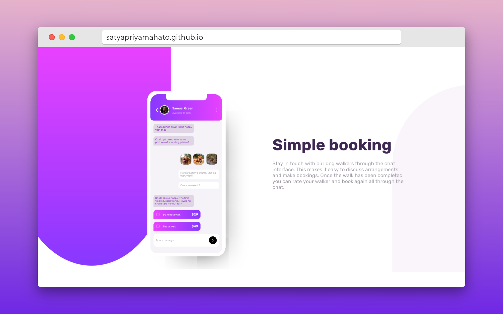

# Frontend Mentor - Chat app CSS illustration solution

This is a solution to the [Chat app CSS illustration challenge on Frontend Mentor](https://www.frontendmentor.io/challenges/chat-app-css-illustration-O5auMkFqY). Frontend Mentor challenges help you improve your coding skills by building realistic projects. 

## Table of contents

- [Overview](#overview)
  - [The challenge](#the-challenge)
  - [Screenshot](#screenshot)
  - [Links](#links)
- [My process](#my-process)
  - [Built with](#built-with)
  - [What I learned](#what-i-learned)
  - [Continued development](#continued-development)
  - [Useful resources](#useful-resources)
- [Author](#author)
- [Acknowledgments](#acknowledgments)

## Overview

### The challenge

Users should be able to:

- View the optimal layout for the component depending on their device's screen size
- **Bonus**: See the chat interface animate on the initial load

### Screenshot

### Links

- Solution URL: [Solution](https://github.com/SatyapriyaMahato/chat-app-css-illustration)
- Live Site URL: [Live site](https://satyapriyamahato.github.io/chat-app-css-illustration/)

## My process

### Built with
- Semantic HTML5 markup
- CSS custom properties
- Flexbox
- Mobile-first workflow

### What I learned
I learned how to work with z-index and gradients- 

### Continued development
I will exploring more on css and get a good grip on it.

### Useful resources
- [w3 schools](https://www.w3schools.com/) - This helped me in uinderstanding the 2s6arrow  functions and their syntax.
- [w3 validator](https://validator.w3.org/) - I used this validate my html code to check for any error of deprications.

## Author

- Website - [Satyapriya Mahato](https://satyapriyamahato.github.io/Personal-Site/)
- Frontend Mentor - [@satyapriyamahato](https://www.frontendmentor.io/profile/SatyapriyaMahato)
- Twitter - [@satyapriyamahato](https://www.twitter.com/satyapriyamahto)
